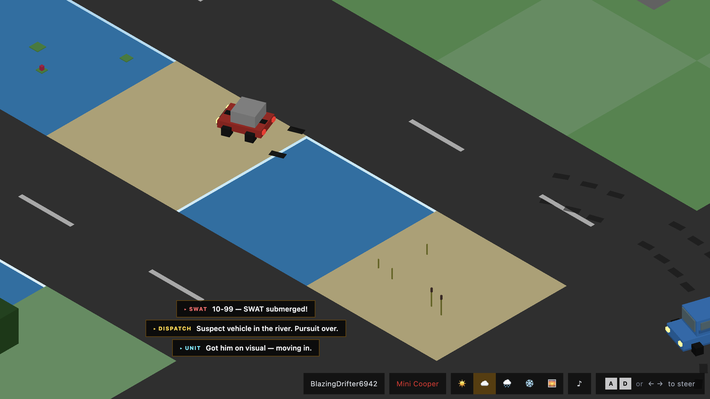
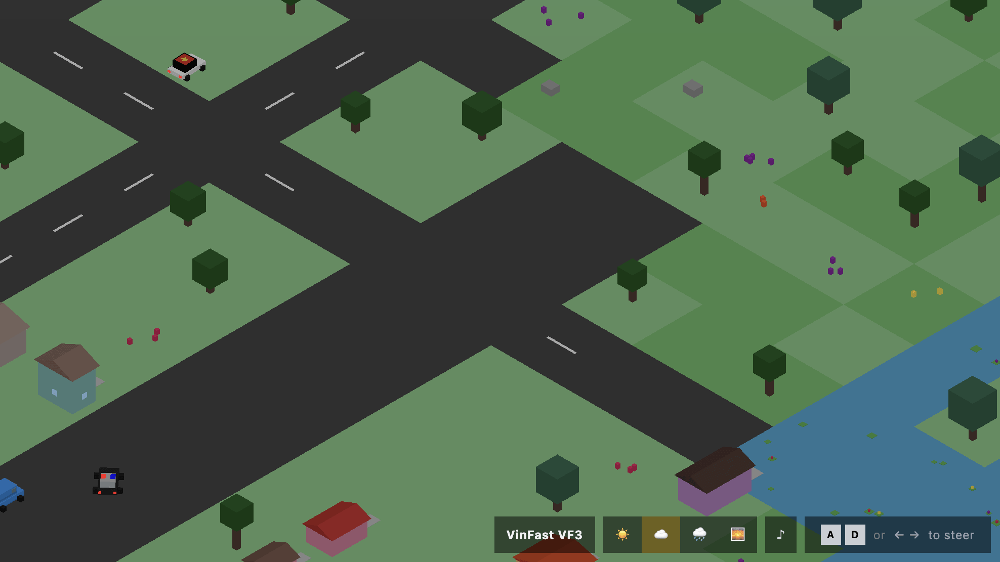
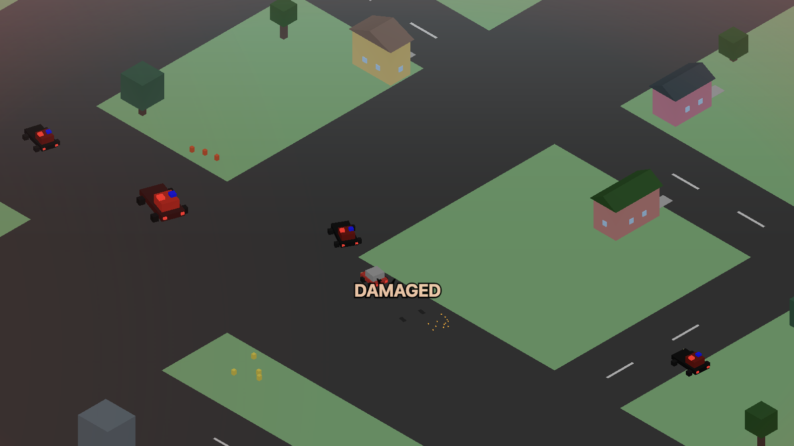

<div align="center">


# Blocky Pursuit

**Evade cops in a blocky city — don't get busted.**

A 3D voxel arcade chase game. The car drives itself; you steer.
Outrun the cops, build combos, lure them into water, survive as long
as you can.



</div>

## Highlights

- **Procedural city** — chunk-streamed world with downtown, suburbs, and nature zones (with rivers)
- **10 unlockable cars** — each with its own top speed, grip, stability, and unlock condition
- **5 weathers** that change how the car drives — Snowy cuts speed 20 % and accel 25 %; Sunny buffs both
- **9 pickups** with distinct silhouettes — Nitro, Shield, Repair, 2X Score, Magnet, Time Warp, EMP, Ghost, Tank
- **Combo + Drown Chain** — skim past cops for a multiplier, drown multiple within 4 s for a chain payout
- **6 cop AI tiers** that escalate by level — Interceptor, PIT-Maneuver, water-fear at the top
- **SWAT mini-boss** from level 7 — tank-ram or drown one for +80 / +25 HP
- **PWA + mobile** — installable, on-screen steering, haptics
- **Leaderboard + replay sharing** via Netlify Functions

## Gameplay

Full mechanics, scoring tables, cop stats, pickup catalog, strategy
notes, and constants cheat sheet live in
**[GAME_PLAY.md](GAME_PLAY.md)**.

<table>
  <tr>
    <td width="33%"></td>
    <td width="33%"></td>
    <td width="33%"></td>
  </tr>
</table>

> [!TIP]
> **Stay on roads.** Off-road gives no score and may be water.
> **Build combos by skimming**, not hitting — a real collision resets the multiplier.
> **Tank flips the game** — for 5 s the cops are the prey.
> **Hunt SWAT from level 7** — +80 score / +25 HP, the best single cop kill in the game.

| Input     | Action         |
| --------- | -------------- |
| `A` / `←` | Steer left     |
| `D` / `→` | Steer right    |
| `Space`   | Pause          |
| Touch L/R | Steer (mobile) |

The car drives itself. You only steer.

## Tech stack

- [Preact](https://preactjs.com) + [`@preact/signals`](https://preactjs.com/guide/v10/signals/) — UI + reactive state
- [Three.js](https://threejs.org) — voxel rendering
- [cannon-es](https://pmndrs.github.io/cannon-es/) — physics
- [UnoCSS](https://unocss.dev) — atomic CSS
- [vite-plugin-pwa](https://vite-plugin-pwa.netlify.app) — installable, fullscreen
- [Netlify Functions](https://docs.netlify.com/build/functions/overview/) + Blobs — leaderboard, replay upload

```
src/                 main loop + state machine, entities, systems, world, ui, audio
netlify/functions/   submit-score, leaderboard, play-recording
netlify/edge-functions/  upload-recording
```

## Local development

```bash
bun install
bun run dev      # http://localhost:5173
```

Production build: `bun run build` (outputs to `dist/`). Deploy with
`netlify deploy --prod` — `netlify.toml` is ready to go.

## Credits

Inspired by [Smashy Road](https://duckduckgo.com/?q=smashy+road+game).
